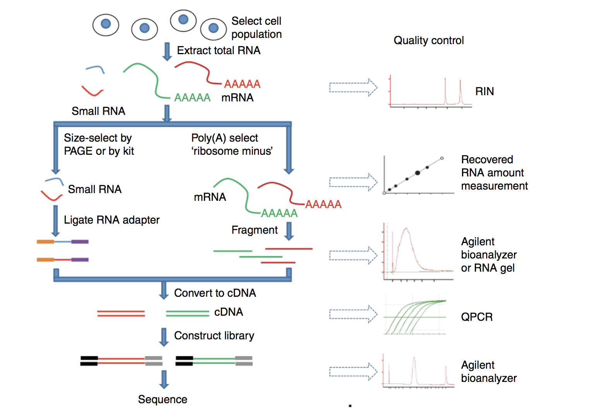

Approximate time: 

## Learning Objectives 

* Detailed description of dataset
* Numbered descriptions of workflow steps leading up to count matrix
* Link out to Illumina video


## RNA-seq processing workflow

Before we get started with differential gene expression, it's important to know where the count matrix came from. In this lesson we will briefly discuss the RNA-processing pipeline and the **different steps we take to go from raw sequencing reads to count matrix**. 

<p align="center">

</p>


### 1. RNA Extraction and library preparation

Before RNA can be sequenced, it must first be extracted and separated from its cellular environment prepared into a cDNA library. There are a number of steps involved which are outlined in the figure below, and in parallel there are various quality checks implemented to make sure wehave quality RNA to move foward with. We briefly describe some of these steps, but also encourage you to access the resources linked at the end of this lesson for more detailed information.

**a. Enriching for RNA.** Once the sample has been treated with DNAse to remove any contaminating DNA sequence, the sample undergoes either selection of the mRNA (polyA selection) or depletion of the rRNA. 

Generally, ribosomal RNA represents the majority of the RNAs present in a cell, while messenger RNAs represent a small percentage of total RNA, ~2% in humans. Therefore, if we want to study the protein-coding genes, we need to enrich for mRNA or deplete the rRNA. For differential gene expression analysis, it is best to enrich for Poly(A)+, unless you are aiming to obtain information about long non-coding RNAs, then do a ribosomal RNA depletion.

> **RNA Quality check**: Traditionally, RNA integrity was assessed via gel electrophoresis by visual inspection of the ribosomal RNA bands. Since it is subjective and has been shown to be inconsistent, Agilent developed a software algorithm that allows for the calculation of an RNA Integrity Number (RIN) which facilitates the interpretation and reproducibility, of RNA quality assessments. RIN provides a means by which samples can be compared in a standardized manner.

**b.Fragmentation and size selection.** The remaining RNA molecules are then fragmented. This is done either via chemical, enzymatic (e.g., RNAses) or physical processes (e.g., shearing). These fragments ten undergo size selection to retain those within a size range that Illumina sequencing machines can handle best, i.e., between 150 to 300 bp. 

> **Fragment size quality check**: After size selection/exclusion the fragment size distribution can be assesed to ensure that it is unimodal and well-defined.

**c. Reverse transcribe RNA into double-stranded cDNA.** Information about which strand a fragment originated from can be preserved by creating stranded libraries. The most commonly used method incorporates deoxy-UTP during the synthesis
of the second cDNA strand (for details see Levin et al. (2010)). Finally, sequence adapters are then ligated to the ends of the fragments. (Size selection can be performed here instead of at the RNA-level.)

**d. PCR amplification.** If the amount of starting material is low and/or to increase the number of cDNA molecules to an amount sufficient for sequencing, libraries are PCR amplified. 

<p align="center">

</p>

*Image source: [Zeng and Mortavi, 2012](https://pubmed.ncbi.nlm.nih.gov/22910383/)*

### 2. Seqeuncing (Illumina)

After preparation of the libraries, sequencing can be performed to generate the nucleotide sequences of the ends of the fragments, which are called **reads**. You will have the choice of sequencing a single end of the cDNA fragments (single-end reads) or both ends of the fragments (paired-end reads).


- SE - Single end dataset => Only Read1
- PE - Paired-end dataset => Read1 + Read2
	- can be 2 separate FastQ files or just one with interleaved pairs

Generally single-end sequencing is sufficient unless it is expected that the reads will match multiple locations on the genome (e.g. organisms with many paralogous genes), assemblies are being performed, or for splice isoform differentiation. Be aware that paired-end reads are generally 2x more expensive.

#### Sequencing-by-synthesis 

Illumina sequencing technology uses a sequencing-by-synthesis approach which is described in the figure below. 

_**Cluster growth**_: The DNA fragments in the cDNA library are denatured and hybridized to the glass flow cell through means of adapters. Each fragment is then massively and clonally amplified, forming clusters of double-stranded DNA. This step is necessary to ensure that the sequencing signal will be strong enough to be detected unambiguously for each base of each fragment.

* **Number of clusters ~= Number of reads**

_**Sequencing:**_ The sequencing of the fragment ends is based on fluorophore labelled dNTPs with reversible terminator elements. Each cycle, a base is incorporated and excited by a laser one at a time. Base calling algorithms determine the sequence of bases of each cluster based on signal intensity levels.

* **Number of sequencing cycles = Length of reads**

<p align="center">

</p>

To explore sequencing by synthesis in more depth, we recommend this really nice animation [available on Illumina's YouTube channel](https://www.youtube.com/watch?v=fCd6B5HRaZ8).

### 3. Quality control of raw sequencing data

The raw reads obtained from the sequencer are stored as **[FASTQ files](https://en.wikipedia.org/wiki/FASTQ_format)**. The FASTQ file format is the defacto file format for sequence reads generated from next-generation sequencing technologies. 

Each FASTQ file is a text file which represents sequence read outs for a sample. Each read is represented by 4 lines as shown below:

```
@HWI-ST330:304:H045HADXX:1:1101:1111:61397
CACTTGTAAGGGCAGGCCCCCTTCACCCTCCCGCTCCTGGGGGANNNNNNNNNNANNNCGAGGCCCTGGGGTAGAGGGNNNNNNNNNNNNNNGATCTTGG
+
@?@DDDDDDHHH?GH:?FCBGGB@C?DBEGIIIIAEF;FCGGI#########################################################
```

|Line|Description|
|----|-----------|
|1|Always begins with '@' and then information about the read|
|2|The actual DNA sequence|
|3|Always begins with a '+' and sometimes the same info in line 1|
|4|Has a string of characters which represent the quality scores; must have same number of characters as line 2|

The quality information for each read is assessed using tools like [FASTQC]().


### 4. Mapping reads and quantification

### 5. Quality control of mapped sequence reads
