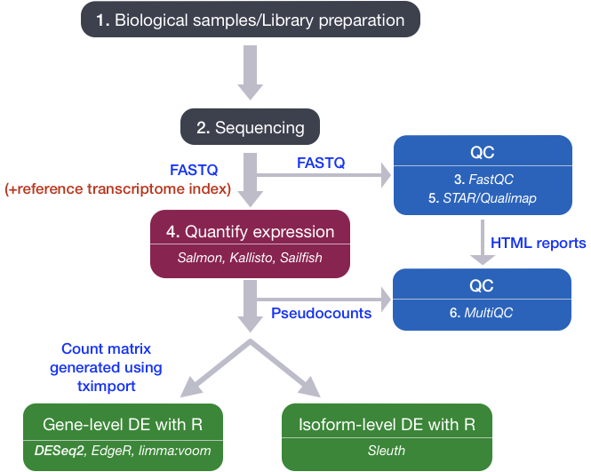
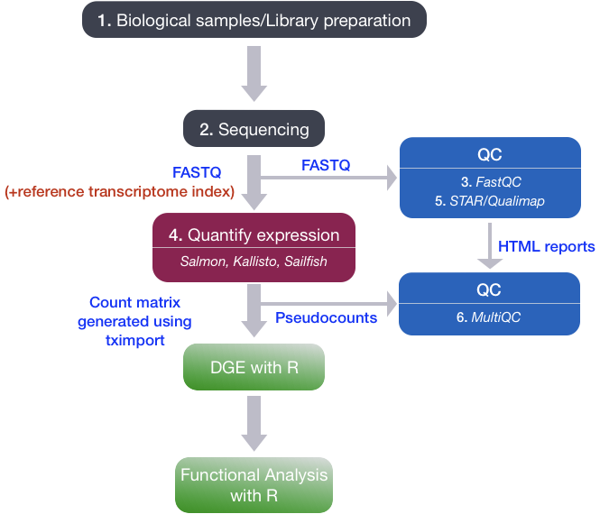
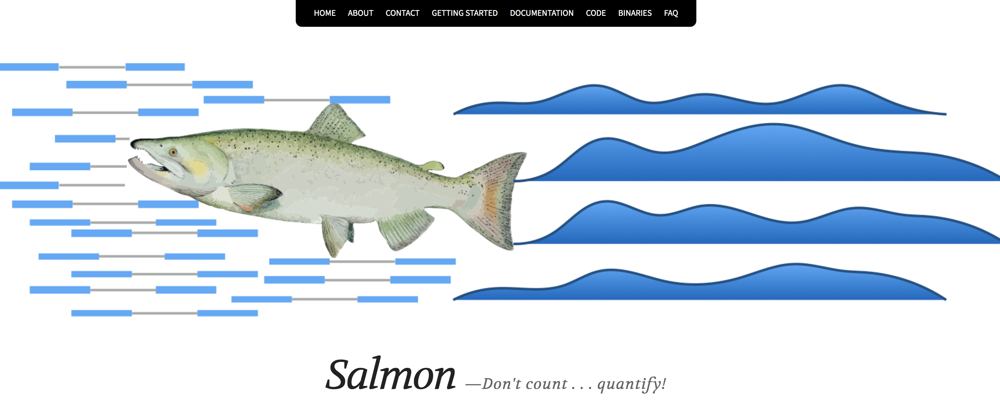

Approximate time: 40 minutes

## Learning objectives

* Understand the different steps of the RNA-seq workflow, from RNA extraction to assessing the expression levels of genes.

# RNA-seq workflow

To perform Differential Gene Expression analysis, we need to start with a matrix of counts representing the levels of gene expression. It is important to understand how the count matrix is generated, before diving into the statistical analysis. 

In this lesson we will briefly discuss the RNA-processing pipeline for bulk RNA-seq, and the **different steps we take to go from raw sequencing reads to a gene expression count matrix**. 

<p align="center">

</p>


<p align="center">

</p>

## 1. RNA Extraction and library preparation

Before RNA can be sequenced, it must first be extracted and separated from its cellular environment prepared into a cDNA library. There are a number of steps involved which are outlined in the figure below, and in parallel there are various quality checks implemented to make sure we have good quality RNA to move foward with. We briefly describe some of these steps, but also encourage you to access the resources linked at the end of this lesson for more detailed information.

**a. Enriching for RNA.** Once the sample has been treated with DNAse to remove any contaminating DNA sequence, the sample undergoes either selection of the mRNA (polyA selection) or depletion of the rRNA. 

Generally, ribosomal RNA represents the majority of the RNAs present in a cell, while messenger RNAs represent a small percentage of total RNA, ~2% in humans. Therefore, if we want to study the protein-coding genes, we need to enrich for mRNA or deplete the rRNA. For differential gene expression analysis, it is best to enrich for Poly(A)+, unless you are aiming to obtain information about long non-coding RNAs, in which case ribosomal RNA depletion is recommended.

> **RNA Quality check**: It is essential to check for the integrity of the extracted RNA prior to starting the cDNA library prepation. Traditionally, RNA integrity was assessed via gel electrophoresis by visual inspection of the ribosomal RNA bands; but that method is time consuming and imprecise. The Bioanalyzer system from Agilent will rapidly assess RNA integrity and calculate an RNA Integrity Number (RIN), which facilitates the interpretation and reproducibility of RNA quality. RIN, essentially, provides a means by which RNA quality from different samples can be compared to each other in a standardized manner.

**b. Fragmentation and size selection.** The remaining RNA molecules are then fragmented. This is done either via chemical, enzymatic (e.g., RNAses) or physical processes (e.g., chemical/mechanical shearing). These fragments then undergo size selection to retain only those fragments within a size range that Illumina sequencing machines can handle best, i.e., between 150 to 300 bp. 

> **Fragment size quality check**: After size selection/exclusion the fragment size distribution should be assesed to ensure that it is unimodal and well-defined.

**c. Reverse transcribe RNA into double-stranded cDNA.** Information about which strand a fragment originated from can be preserved by creating stranded libraries. The most commonly used method incorporates deoxy-UTP during the synthesis
of the second cDNA strand (for details see Levin et al. (2010)). Once double-stranded cDNA fragments are generated, sequence adapters are ligated to the ends. (Size selection can be performed here instead of at the RNA-level.)

**d. PCR amplification.** If the amount of starting material is low and/or to increase the number of cDNA molecules to an amount sufficient for sequencing, libraries are usually PCR amplified. Run as few amplication cycles as possible to avoid PCR artefacts.  

<p align="center">

</p>

*Image source: [Zeng and Mortavi, 2012](https://pubmed.ncbi.nlm.nih.gov/22910383/)*

## 2. Sequencing (Illumina)

Sequencing of the cDNA libraries will generate **reads**. Reads correspond to the nucleotide sequences of the ends of each of the cDNA fragements in the library. You will have the choice of sequencing either a single end of the cDNA fragments (single-end reads) or both ends of the fragments (paired-end reads).


- SE - Single end dataset => Only Read1
- PE - Paired-end dataset => Read1 + Read2
	- can be 2 separate FastQ files or just one with interleaved pairs

Generally single-end sequencing is sufficient unless it is expected that the reads will match multiple locations on the genome (e.g. organisms with many paralogous genes), assemblies are being performed, or for splice isoform differentiation. Be aware that paired-end reads are generally 2x more expensive.

### Sequencing-by-synthesis 

Illumina sequencing technology uses a sequencing-by-synthesis approach. **To explore sequencing by synthesis in more depth, please watch [this linked video on Illumina's YouTube channel](https://www.youtube.com/watch?v=fCd6B5HRaZ8).**

We have privided a brief explanation of the steps below:

_**Cluster growth**_: The DNA fragments in the cDNA library are denatured and hybridized to the glass flowcell (adapter complementarity). Each fragment is then clonally amplified, forming a cluster of double-stranded DNA. This step is necessary to ensure that the sequencing signal will be strong enough to be detected/captured unambiguously for each base of each fragment.

* **Number of clusters ~= Number of reads**

_**Sequencing:**_ The sequencing of the fragment ends is based on fluorophore labelled dNTPs with reversible terminator elements. In each sequencing cycle, a base is incorporated into every cluster and excited by a laser. 

***Image acquisition:*** Each dNTP has a distinct excitatory signal emission which is captured by cameras. 

***Base calling:*** The Base calling program will then generate the sequence of bases, **i.e. reads**, for each fragement/cluster by assessing the images captured during the many sequencing cycles. In addition to calling the base in every position, the base caller will also report the certainty with which it was able to make the call (quality information).

* **Number of sequencing cycles = Length of reads**

<p align="center">

</p>


## 3. Quality control of raw sequencing data (FastQC)

The raw reads obtained from the sequencer are stored as **[FASTQ files](https://en.wikipedia.org/wiki/FASTQ_format)**. The FASTQ file format is the defacto file format for sequence reads generated from next-generation sequencing technologies. 

Each FASTQ file is a text file which represents sequence readouts for a sample. Each read is represented by 4 lines as shown below:

```
@HWI-ST330:304:H045HADXX:1:1101:1111:61397
CACTTGTAAGGGCAGGCCCCCTTCACCCTCCCGCTCCTGGGGGANNNNNNNNNNANNNCGAGGCCCTGGGGTAGAGGGNNNNNNNNNNNNNNGATCTTGG
+
@?@DDDDDDHHH?GH:?FCBGGB@C?DBEGIIIIAEF;FCGGI#########################################################
```

|Line|Description|
|----|-----------|
|1|Always begins with '@' and then information about the read|
|2|The actual DNA sequence|
|3|Always begins with a '+' and sometimes the same info as in line 1|
|4|Has a string of characters which represent the quality scores; must have same number of characters as line 2|

[FastQC](https://www.bioinformatics.babraham.ac.uk/projects/fastqc/) is a commonly used software that provides a simple way to do some **quality control checks on raw sequence data**. 

The main functions include:

* Providing a quick overview to tell you in which areas there may be problems
* Summary graphs and tables to quickly assess your data
* Export of results to an HTML based permanent report


## 4. Quantify expression

Once we have explored the quality of our raw reads, we can move on to quantifying expression at the transcript level. The goal of this step is to **identify from which transcript each of the reads originated from and the total number of reads associated with each transcript**.

Tools that have been found to be most accurate for this step in the analysis are referred to as **lightweight alignment tools**, which include:
* [Kallisto](https://pachterlab.github.io/kallisto/about), 
* [Sailfish](http://www.nature.com/nbt/journal/v32/n5/full/nbt.2862.html) and 
* [Salmon](https://combine-lab.github.io/salmon/)

Each of the tools in the list above work slightly differently from one another. However, common to all of them is that **they avoid base-to-base genomic alignment of the reads**. Genomic alignment is a step performed by older splice-aware alignment tools such as [STAR](https://academic.oup.com/bioinformatics/article/29/1/15/272537) and [HISAT2](https://daehwankimlab.github.io/hisat2/). In comparison to these tools, the lightweight alignment tools not only provide quantification estimates **faster** (typically more than 20 times faster), but also prove **improvements in accuracy** [[1](https://genomebiology.biomedcentral.com/articles/10.1186/s13059-015-0734-x)]. 

**We will use the expression estimates, often referred to as 'pseudocounts', obtained from [Salmon](https://combine-lab.github.io/salmon/)** as the starting point for the differential gene expression analysis.

<p align="center">

</p>

## 5. Quality control of aligned sequence reads (STAR/Qualimap)

As mentioned above, the differential gene expression analysis will use transcript/gene pseudocounts generated by Salmon. However, to perform some basic quality checks on the sequencing data, it is important to align the reads to the whole genome. Either STAR or HiSAT2 are able to perform this step and generate a [BAM](https://samtools.github.io/hts-specs/SAMv1.pdf) file that can be used for QC.

A tool called [Qualimap](http://qualimap.bioinfo.cipf.es/doc_html/intro.html) **explores the features of aligned reads in the context of the genomic region they map to**, hence providing an overall view of the data quality (as an HTML file). Various quality metrics assessed by Qualimap include:

* DNA or rRNA contamination
* 5'-3' biases
* Coverage biases

## 6. Quality control: aggregating results with MultiQC

Throughout the workflow we have performed various steps of quality checks on our data. You will need **to do this for every sample in your dataset**, making sure these metrics are consistent across the samples for a given experiment. Outlier samples should be flagged for further investigation and potential removal.

Manually tracking these metrics and browsing through multiple HTML reports (FastQC, Qualimap) and log files (Salmon, STAR) for each samples is tedious and prone to errors. **[MultiQC](https://multiqc.info/) is a tool which aggregates results from several tools and generates a single HTML report** with plots to visualize and compare various QC metrics between the samples. Assessment of the QC metrics may result in the removal of samples before proceeeding to the next step, if necessary.

***

Once the QC has been performed on all the samples, we are ready to get started with Differential Gene Expression analysis with [DESeq2](http://bioconductor.org/packages/devel/bioc/vignettes/DESeq2/inst/doc/DESeq2.html)!

<p align="center">

</p>


***
*This lesson has been developed by members of the teaching team at the [Harvard Chan Bioinformatics Core (HBC)](http://bioinformatics.sph.harvard.edu/). These are open access materials distributed under the terms of the [Creative Commons Attribution license](https://creativecommons.org/licenses/by/4.0/) (CC BY 4.0), which permits unrestricted use, distribution, and reproduction in any medium, provided the original author and source are credited.*
