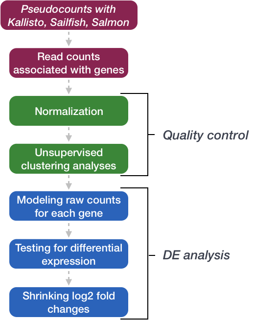

[GEO]: https://www.ncbi.nlm.nih.gov/geo/query/acc.cgi?acc=GSE51443 "Gene Expression Omnibus"
[SRA]: https://trace.ncbi.nlm.nih.gov/Traces/sra/?study=SRP031507 "Sequence Read Archive"

Approximate time: 60 minutes

## Learning Objectives 

* Explore the characteristics of RNA-seq count data
* Evaluate the mean-variance relationship in relation to the negative binomial model
* Understand the importance of biological replicates

# Exploring RNA-seq count data

## Count matrix

When we start our differential gene expression analysis we begin with a **matrix summarizing the gene-level expression in each sample of your dataset**. The rows in the matrix correspond to genes, and the columns correspond to samples. In each position of the matrix you will have an integer value representing the total number of sequence reads that originated from a particular gene in a sample.

<p align="center">

</p>

The higher the number of counts indicates more reads are associated with that gene and suggests a higher level of expression of that gene. However, this is not necessarily true and we will delve deeper into this later in this lesson and in the course.

## Characteristics of RNA-seq count data

To get an idea about how RNA-seq counts are distributed, let's plot a histogram of the counts for a single sample, 'Mov10_oe_1':

```r
ggplot(data) +
  geom_histogram(aes(x = Mov10_oe_1), stat = "bin", bins = 200) +
  xlab("Raw expression counts") +
  ylab("Number of genes")
```

<p align="center">

</p>

This plot illustrates some **common features** of RNA-seq count data:

* a low number of counts associated with a large proportion of genes
* a long right tail due to the lack of any upper limit for expression
* large dynamic range

Looking at the shape of the histogram, we see that it is _not normally distributed_. For RNA-seq data this will always be the case. Moreover, the underlying data, as we observed earlier, is integer counts instead rather than continuous measurements. We need to take these characteristics into account when deciding on what statistical model to use.

## Modeling count data

Count data in general can be modeled with various distributions:

1. **Binomial distribution:** Gives you the **probability of getting a number of heads upon tossing a coin a number of times**. Based on discrete events and used in situations when you have a certain number of cases.

2. **Poisson distribution:** For use, when **the number of cases is very large (i.e. people who buy lottery tickets), but the probability of an event is very small (probability of winning)**. The Poisson is similar to the binomial, but is based on continuous events. Appropriate for data where mean == variance. 

> [Details provided by Rafael Irizarry in the EdX class.](https://youtu.be/fxtB8c3u6l8)


**So what do we use for RNA-seq count data?**

With RNA-Seq data, **a very large number of RNAs are represented and the probability of pulling out a particular transcript is very small**. This scenario is most similar to the lottery described above, suggesting that perhaps the Poisson distribution is most appropriate. However, this **will depend on the relationship between mean and variance in our data**.

### Mean versus variance

To assess the properties of the data we are working with, we can use the three samples corresponding to the 'Mov10 overexpression' replicates. First compute a vector of mean values, then compute a vector of variance values. Then plot these values against each other to evaluate the relationship between them.

```r
mean_counts <- apply(data[,6:8], 1, mean)        #The second argument '1' of 'apply' function indicates the function being applied to rows. Use '2' if applied to columns 
variance_counts <- apply(data[,6:8], 1, var)
df <- data.frame(mean_counts, variance_counts)

ggplot(df) +
        geom_point(aes(x=mean_counts, y=variance_counts)) + 
        scale_y_log10(limits = c(1,1e9)) +
        scale_x_log10(limits = c(1,1e9)) +
        geom_abline(intercept = 0, slope = 1, color="red")
```

Your plot should look like the scatterplot below. Each data point represents a gene and the red line represents x = y. 

<p align="center">

</p>

1. The **mean is not equal to the variance** (the scatter of data points does not fall on the diagonal).
2. For the genes with **high mean expression**, the variance across replicates tends to be greater than the mean (scatter is above the red line).
3. For the genes with **low mean expression** we see quite a bit of scatter. We usually refer to this as **"heteroscedasticity"**. That is, for a given expression level in the low range we observe a lot of variability in the variance values.

***

**Exercise**

Try this with the control replicates?

***


## An alternative: The Negative Binomial distribution

Our **data fail to satisfy the criteria for a the Poisson distribution, and typical RNA-seq data will do the same**. If the proportions of mRNA stayed exactly constant between the biological replicates for a sample group, we could expect a Poisson distribution (where mean == variance). However, we always expect some amount of variability between replicates (we'll discuss this in more detail later in the lesson). Alternatively, if we continued to add more replicates (i.e. > 20) we should eventually see the scatter start to reduce and the high expression data points move closer to the red line. So in theory, if we had enough replicates we could use the Poisson.

In practice, a large number of replicates can be either hard to obtain (depending on how samples are obtained) and/or can be unaffordable. It is more common to see datasets with only a handful of replicates (~3-5) and reasonable amount of variation between them. The distribution that fits RNA-seq data best, given this type of variability between replicates, is the Negative Binomial. Essentially, **the Negative Binomial is a good approximation for data where the mean < variance**, as is the case with RNA-Seq count data.

> **NOTE:** If we use the Poisson this will underestimate variability leading to an increase in false positive DE genes.

<p align="center">

</p>

## Replicates and variability

Biological replicates represent multiple samples (i.e. RNA from different mice) which correspond to the same sample class or group. Intuitively, we would expect samples from the same sample group (i.e. that under similar conditions/perturbations) to exhibit a similar transcriptional profile. In most cases, there will be a high degree of similarity of samples within a group but there will also inevitably be many differences. The **source of this variability on a gene's expression can be attributed to many factors**, some of which are identifiable and others that remain unknown.

<p align="center">

</p>


With differential expression analysis, we are looking for genes that change in expression between two or more groups. For example, 
- case vs. control
- correlation of expression with some variable or clinical outcome

However, there is much more going on with your data than what you are anticipating. Genes that vary in expression level is a consequence of not only the experimental variable(s) of interest but also due to extraneous sources. **The goal of differential expression analysis is to identify and correct for sources of variation such that we can separate the “interesting” from the “uninteresting”.**

Let's take a closer look at the figure below as an example. Expression (counts) is plotted here for 'GeneA' in the 'untreated' and 'treated' groups. Each dot corresponds to expression for a single sample, and the dots are colored based on which group they belong to.

<p align="center">

</p>

The mean expression level of GeneA for the 'treated' group is twice as large as the mean expression level for the 'untreated' group. But is the difference in expression **between groups** significant given the amount of variation observed **within groups** (across replicates)?

It is possible that the difference is not actually significant. We need to take into account the variation in the data (and where it might be coming from) when determining whether genes are differentially expressed. Modeling our data with the negative binomial distribution allows us to do this.

### How many replicates are enough?

More is always better! At minimum we recommend three replicates for each sample group, but if you can increase that by any number it is in your best interest. The value of additional replicates is that **as you add more data, you get increasingly precise estimates of group means, and ultimately greater confidence in the ability to reliably distinguish differences between sample classes**.

Having many replicates allow us to:
* estimate variation for each gene
* randomize out unknown covariates
* spot outliers
* improve precision of expression and fold-change estimates

The figure below is taken from a study directly evaluating the relationship between sequencing depth and number of replicates on the number of differentially expressed genes [[1](https://academic.oup.com/bioinformatics/article/30/3/301/228651/RNA-seq-differential-expression-studies-more)]. 

<p align="center">

</p>

Note that an **increase in the number of replicates tends to return more DE genes than increasing the sequencing depth**. Therefore, generally more replicates are better than higher sequencing depth, with the caveat that higher depth is required for detection of lowly expressed DE genes and for performing isoform-level differential expression. 

## Differential Expression with DESeq2

DESeq2 is a popular tool for gene-level differential expression analysis. It uses the negative binomial distribution, employing a slightly more stringent approach compared to some methods yet having a good balance between sensitivity and specificity (reducing both false positives and false negatives). Consequently, the number of differentially expressed genes will be fewer, but as shown in the figure above these genes have been found to be a subset of genes identified by other methods.

> ### Other tools for Differential Expression Analysis
> There are a number of software packages that have been developed for differential expression analysis of RNA-seq data. Most adopt the **negative binomial approach**, however there are other tools based on non-parametric methods suitable for larger sample sizes. An extensive comparison of these methods can be found in [Soneson and Dleorenzi, 2013](https://bmcbioinformatics.biomedcentral.com/articles/10.1186/1471-2105-14-91).


We will be using [DESeq2](https://genomebiology.biomedcentral.com/articles/10.1186/s13059-014-0550-8) for the analysis in this workshop. **The analysis steps with DESeq2 are shown in the flowchart below in green and blue**. 

<p align="center">

</p>

We will go in-depth into each of these steps in the following lessons, but additional details and helpful suggestions regarding DESeq2 can be found in the [DESeq2 vignette](http://bioconductor.org/packages/devel/bioc/vignettes/DESeq2/inst/doc/DESeq2.html).

***
*This lesson has been developed by members of the teaching team at the [Harvard Chan Bioinformatics Core (HBC)](http://bioinformatics.sph.harvard.edu/). These are open access materials distributed under the terms of the [Creative Commons Attribution license](https://creativecommons.org/licenses/by/4.0/) (CC BY 4.0), which permits unrestricted use, distribution, and reproduction in any medium, provided the original author and source are credited.*
