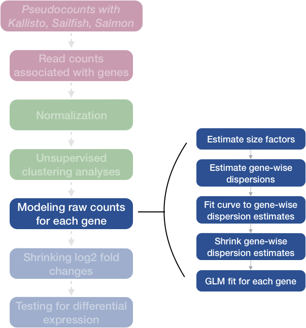
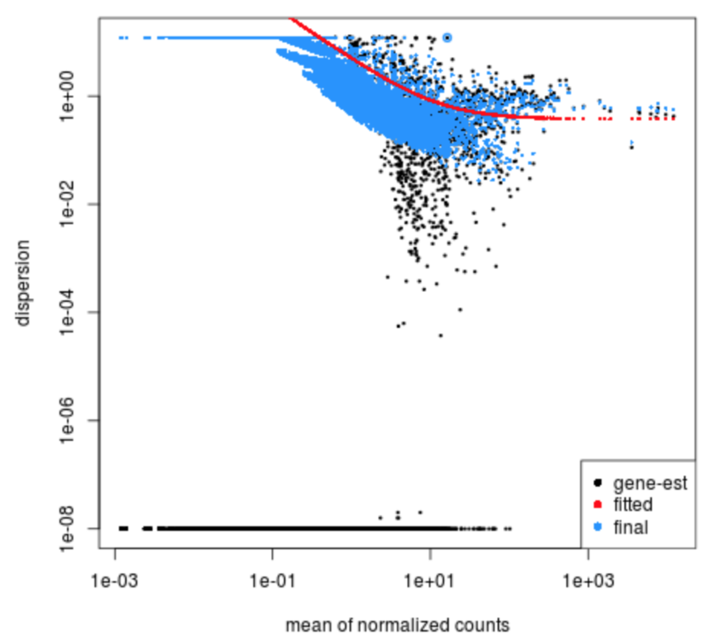

Approximate time: 60 minutes

## Learning Objectives 

* Explain the different steps involved in running `DESeq()`
* Examine size factors and understand the source of differences
* Inspect gene-level dispersion estimates 
* Recognize the importance of dispersion during differential expression analysis


## DESeq2 differential gene expression analysis workflow

Previously, we created the DESeq2 object using the appropriate design formula and running DESeq2 using the two lines of code:

```r
# DO NOT RUN

## Create DESeq2Dataset object
dds <- DESeqDataSetFromTximport(txi, colData = meta, design = ~ sampletype)

## Run analysis
dds <- DESeq(dds)
```

We completed the entire workflow for the differential gene expression analysis with DESeq2. The steps in the analysis are output below:

<p align="center">

</p>

We will be taking a detailed look at each of these steps to better understand how DESeq2 is performing the statistical analysis and what metrics we should examine to explore the quality of our analysis.

### Step 1: Estimate size factors

The first step in the differential expression analysis is to estimate the size factors, which is exactly what we already did to normalize the raw counts. 

<p align="center">

</p>
	
DESeq2 will automatically estimate the size factors when performing the differential expression analysis. However, if you have already generated the size factors using `estimateSizeFactors()`, as we did earlier, then DESeq2 will use these values.

To normalize the count data, DESeq2 calculates size factors for each sample using the *median of ratios method* discussed previously in the ['Count normalization'](02_DGE_count_normalization.md) lesson. 

#### MOV10 DE analysis: examining the size factors

Let's take a quick look at size factor values we have for each sample:

```
## Check the size factors
sizeFactors(dds)

Irrel_kd_1 Irrel_kd_2 Irrel_kd_3 Mov10_kd_2 Mov10_kd_3 Mov10_oe_1 Mov10_oe_2 
 1.1149694  0.9606733  0.7492240  1.5633640  0.9359695  1.2262649  1.1405026 
Mov10_oe_3 
 0.6542030 
```
 
These numbers should be identical to those we generated initially when we had run the function `estimateSizeFactors(dds)`. Take a look at the total number of reads for each sample:

```r
## Total number of raw counts per sample
colSums(counts(dds))
```

*How do the numbers correlate with the size factor?*

We see that the larger size factors correspond to the samples with higher sequencing depth, which makes sense, because to generate our normalized counts we need to divide the counts by the size factors. This accounts for the differences in sequencing depth between samples.

Now take a look at the total depth after normalization using:

```r
## Total number of normalized counts per sample
colSums(counts(dds, normalized=T))
```

*How do the values across samples compare with the total counts taken for each sample?*

You might have expected the counts to be the exact same across the samples after normalization. However, DESeq2 also accounts for RNA composition during the normalization procedure. By using the median ratio value for the size factor, DESeq2 should not be biased to a large number of counts sucked up by a few DE genes; however, this may lead to the size factors being quite different than what would be anticipated just based on sequencing depth.

### Step 2: Estimate gene-wise dispersion

The next step in the differential expression analysis is the estimation of gene-wise dispersions. Before we get into the details, we should have a good idea about what dispersion is referring to in DESeq2.

<p align="center">

</p>

In RNA-seq count data, we know:

1. To determine differentially expressed genes, we evaluate the **variation of expression between groups (of interest) and compare that to the variation within the groups** (between replicates). 
2. For each individual gene, **the mean is not equal to the variance.** 

  * Genes that are highly expressed will have a more consistent level of variations, but it will be higher than the mean. 
  * Lowly expressed genes will exhibit variation that hovers around the mean (but with a higher amount of variability). 
 
_This complicated relationship means that **we cannot just use the observed variance to account for within-group variation**._ Instead DESeq2 uses dispersion.

<p align="center">

</p>


**What is dispersion?**

The dispersion parameter **models the within-group variability by describing how much the variance deviates from the mean**. A dispersion of 1 would indicate that there is no deviance from the mean (i.e mean == variance). A typical RNA-seq dataset, will exhibit some amount of biological variability present across replicates and so we will always have dispersion values less than one.

| | Effect on dispersion |
|:---:|:---:|
| Variance increases | Dispersion increases |
| Mean expression increases | Dispersion decreases |

**Dispersion values in DESeq2**

DESeq2 estimates the dispersion for each gene based on the gene's expression level (mean counts of within-group replicates) and observed variance across replicates, as we demonstrated with the formula above. In this way, the dispersion estimates for genes with the same mean will differ only based on their variance. **Therefore, the dispersion estimates reflect the variance in gene expression for a given mean value.** 

<p align="center">

</p>

> _In this plot we have dispersion on the y-axis and mean normalized counts on the x-axis. Each black dot represents a gene and its intial maximum likelihood dispersion estimate (MLE) given the observed data. Simply looking at the trend of black dots, we observe an inverse relationship between mean and dispersion. More detail on the fitted red line and blue dots will be decribed later in this lesson._

Since we have only a few (3-6) replicates per group, the **dispersion estimates for each gene are often unreliable**. As we walk through the next few steps, we will discuss how this issue is resolved.

### Step 3: Fit curve to gene-wise dispersion estimates

The next step in the workflow is to fit a curve to the gene-wise dispersion estimates. The idea behind fitting a curve to the data is that different genes will have different scales of biological variability, but, across all genes, there will be a distribution of reasonable estimates of dispersion. 

<p align="center">

</p>
	
This curve is displayed as a **red line** in the figure presented below. This fitted line allows DESeq2 to **utilize information across all genes to generate more accurate estimates** using a method called 'shrinkage' (described in Step 4).

<p align="center">

</p>
	
### Step 4: Shrink gene-wise dispersion estimates toward the values predicted by the curve

The next step in the workflow is to shrink the gene-wise dispersion estimates toward the expected dispersion values.

<p align="center">

</p>

**DESeq2 assumes that genes with similar expression levels should have similar dispersion.** As such the fitted curve provides a range of expected dispersion values a range of mean expression level. 

If the initial estimate (black dot) is much lower than the fitted curve then values are shrunken (blue dots) towards the red line. Dispersion estimates that are slightly above the curve are also shrunk toward the curve for better dispersion estimation; however, genes with **extremely high dispersion values are not** (see right side figure below; these genes are shown surrounded by blue circle). This is due to the likelihood that the gene does not follow the modeling assumptions and has higher variability than others for biological or technical reasons [[1](https://genomebiology.biomedcentral.com/articles/10.1186/s13059-014-0550-8)].

<p align="center">

</p>

_MAP, maximum a posteriori; MLE, maximum-likelihood estimate. For more detailed information please see [Love MI, Huber W, Anders S, Genome Biology 2014](https://genomebiology.biomedcentral.com/articles/10.1186/s13059-014-0550-8)_

The **strength of the shrinkage for each gene depends on**:
	
- how close gene dispersions are from the curve 
- sample size (more samples = less shrinkage)

**This dispersion shrinkage method is particularly important to reduce false positives in the differential expression analysis.** This step allows for more accurate identification of differentially expressed genes when sample sizes are small. 

### Interpretation of the dispersion plot

To create this plot with your data, you use the function:

```r
plotDispEsts(dds)
```
 
**This is a good plot to examine to ensure your data is a good fit for the DESeq2 model.** Evaluate the plot to see if:

* The data to generally scatter around the curve, with the dispersion decreasing with increasing mean expression levels.
* How much shrinkage you get across the whole range of means in your data. For any experiment with low degrees of freedom, you will expect to see more shrinkage.
* The data scatter in a cloud or different shapes, then you might want to explore your data more to see if you have contamination (mitochondrial, etc.) or outlier samples. 

Examples of **worrisome dispersion plots** are shown below:

The plot below shows a cloud of dispersion values, which do not generally follow the curve. This would be worrisome and suggests a bad fit of the data to the model. 

<p align="center">

</p>
	
The next plot shows the dispersion values initially decreasing, then increasing with larger expression values. The larger mean expression values should not have larger dispersions based on our expectations - we expect decreasing dispersions with increasing mean. This indicates that there is less variation for more highly expressed genes than expected. This also indicates that there could be an outlier sample or contamination present in our analysis.

<p align="center">

</p>

#### MOV10 DE analysis: exploring the dispersion estimates and assessing model fit

Let's take a look at the dispersion estimates for our MOV10 data:

```r
## Plot dispersion estimates
plotDispEsts(dds)
```

<p align="center">

</p>

**Since we have a small sample size, for many genes we see quite a bit of shrinkage. Do you think our data are a good fit for the model?**

We see a nice decrease in dispersion with increasing mean expression, which is good. We also see the dispersion estimates generally surround the curve, which is also expected. Overall, this plot looks good. We do see strong shrinkage, which is likely due to the fact that we have only two replicates for one of our sample groups. The more replicates we have, the less shrinkage is applied to the dispersion estimates, and the more DE genes are able to be identified. We would generally recommend having at least 4 biological replicates per condition for better estimation of variation.

***

**Exercise**

Given the dispersion plot below, would you have any concerns regarding the fit of your data to the model? 
	
- If not, what aspects of the plot makes you feel confident about your data?
- If so, what are your concerns? What would you do to address them?

<p align="center">

</p>

---

*This lesson has been developed by members of the teaching team at the [Harvard Chan Bioinformatics Core (HBC)](http://bioinformatics.sph.harvard.edu/). These are open access materials distributed under the terms of the [Creative Commons Attribution license](https://creativecommons.org/licenses/by/4.0/) (CC BY 4.0), which permits unrestricted use, distribution, and reproduction in any medium, provided the original author and source are credited.*

*Some materials and hands-on activities were adapted from [RNA-seq workflow](http://www.bioconductor.org/help/workflows/rnaseqGene/#de) on the Bioconductor website*

***

 

