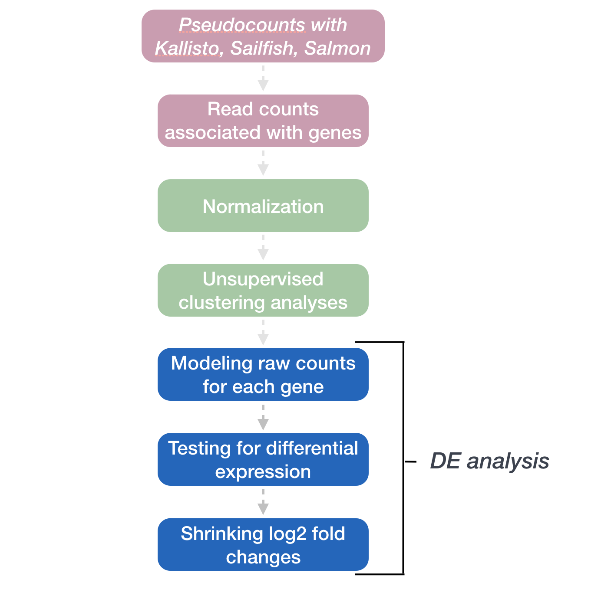

Approximate time: 60 minutes

## Learning Objectives 

* Desribe the process of model fitting 
* Compare two methods for hypothesis testing (Wald test vs. LRT)
* Recongnize the importance of multiple test correction
* Identify different methods for multiple test correction


# DESeq2: Model fitting and Hypothesis testing 

The final step in the DESeq2 workflow is taking the counts for each gene and fitting it to the model and testing for differential expression.

<p align="center">

</p>

## Generalized Linear Model 

As described [earlier](01c_RNAseq_count_distribution.md), the count data generated by RNA-seq exhibits overdispersion (variance > mean) and the statistical distribution used to model the counts needs to account for this. As such, DESeq2 uses a **negative binomial distribution to model the RNA-seq counts using the equation below**:

<p align="center">

</p>

The two parameters required are the **size factor, and the dispersion estimate**. Next, a generalized linear model (GLM) of the NB family is used to fit the data. Modeling is a mathematically formalized way to approximate how the data behaves given a set of parameters.

> "_In statistics, the generalized linear model (GLM) is a flexible generalization of ordinary linear regression that allows for response variables that have error distribution models other than a normal distribution. The GLM generalizes linear regression by allowing the linear model to be related to the response variable via a link function and by allowing the magnitude of the variance of each measurement to be a function of its predicted value." ([Wikipedia](https://en.wikipedia.org/wiki/Generalized_linear_model))_.

After the model is fit, coefficients are estimated for each sample group along with their standard error. The coefficents are the estimates for the **log2 foldchanges**, and will be used as input for hypothesis testing.


## Hypothesis testing 

The first step in hypothesis testing is to set up a **null hypothesis** for each gene. In our case, the null hypothesis is that there is **no differential expression across the two sample groups (LFC == 0)**. Notice that we can do this without observing any data, because it is based on a thought experiment. Second, we use a statistical test to determine if based on the observed data, the null hypothesis is true. 

### Wald test

In DESeq2, the **Wald test is the default used for hypothesis testing when comparing two groups**. The Wald test is a test usually performed on parameters that have been estimated by maximum likelihood. In our case we are testing each gene model coefficient (LFC) which was derived using parameters like dispersion, which were estimated using maximum likelihood. If there are more than 2 sample classes within a variable (for example, if you had low, medium, and high treatment levels) then DESeq2 will generate two pairwise comparisons when low is set as the control (see [here](https://hbctraining.github.io/DGE_workshop_salmon_online/lessons/05b_wald_test_results.html) for more info): low vs. medium, and low vs. high. 

DESeq2 implements the Wald test by:
* Taking the LFC and dividing it by its standard error, resulting in a z-statistic
* The z-statistic is compared to a standard normal distribution, and a p-value is computed reporting the probability that a z-statistic at least as extreme as the observed value would be selected at random
* If the p-value is small we reject the null hypothesis and state that there is evidence against the null (i.e. the gene is differentially expressed).

The **model fit and Wald test were already run previously as part of the `DESeq()` function**:

```r
## DO NOT RUN THIS CODE

## Create DESeq2Dataset object
dds <- DESeqDataSetFromTximport(txi, colData = meta, design = ~ sampletype)

## Run analysis
dds <- DESeq(dds)
```

### Likelihood ratio test (LRT)

DESeq2 also offers the Likelihood Ratio Test (LRT) as an alternative **hypothesis test for when we are comparing more than two sample classes**. Rather than evaluating whether a gene's expression is up- or down-regulated in one class compared to another, the LRT **identifies genes that are changing in expresssion in any direction across the different sample classes**. 

_How does this compare to the Wald test?_

The **Wald test** (default) only **estimates one model per gene** and evaluates the null hypothesis that LFC == 0.

For the **Likelihood Ratio Test** is also performed on parameters that have been estimated by maximum likelihood. For this test **two models are estimated per gene; the fit of one model is compared to the fit of the other model.**

<p align="center">

</p>

* m1 is the reduced model (i.e the design formula with your main factor term removed)
* m2 is the full model (i.e. the full design formula you provided when creating your `dds` object)

> _This type of test can be especially useful in analyzing time course experiments_. 

Here, we are evaluating the **null hypothesis that the full model fits just as well as the reduced model**. If we reject the null hypothesis, this suggests that there is a significant amount of variation explained by the full model (and our main factor of interest), therefore the gene is differentially expressed across the different levels. DESeq2 implements the LRT by using an Analysis of Deviance (ANODEV) to compare the two model fits. It is shown that LR follows a chi-squared distribution, and this can be used to calculate and associated p-value.

To use the LRT, we use the `DESeq()` function but this time adding two arguments: 

1. specifying that we want to use the LRT test
2. the 'reduced' model

```r
# The full model was specified previously with the `design = ~ sampletype`:
# dds <- DESeqDataSetFromTximport(txi, colData = meta, ~ sampletype)

# Likelihood ratio test
dds_lrt <- DESeq(dds, test="LRT", reduced = ~ 1)
```

Since our 'full' model only has one factor (`sampletype`), the 'reduced' model (removing that factor) leaves us with nothing in our design formula. DESeq2 cannot fit a model with nothing in the design formula, and so in the scenario where you have no additional covariates the intercept is modeled using the syntax `~ 1`.

***

**Exercise**

You are studying brain maturation and growth patterns in mouse cortex and have obtained RNA-seq data for a total of 24 mice. These samples were acquired at 2 developmental stages (3 dpf and 10 dpf) and with or without treatment using a growth inhibitor (Monoamine oxidase (MAO) inhibitors). For each developmental stage and treatment combination you have 6 replicates. You also have sex information for these mice (12 males and 12 females).

1. What steps are necessary to take to decide what your model should be?
2. What is an appropriate hypothesis test if you are testing for expression differences across the developmental stages? 
3. Provide the line of code used to create the `dds` object. 
4. Provide the line of code used to run DESeq2.
5. Would you use a different hypothesis test if you had 3 developmental timepoints?  

***

## Multiple test correction

Regardless of whether we use the Wald test or the LRT, each gene that has been tested will be associated with a p-value. It is this result which we use to determine which genes are considered significantly differentially expressed. However, **we cannot use the p-value directly.**

### What does the p-value mean?

A gene with a significance cut-off of p < 0.05, means there is a 5% chance it is a false positive. For example, if we test 20,000 genes for differential expression, at p < 0.05 we would expect to find 1,000 genes by chance. If we found 3000 genes to be differentially expressed total, roughly one third of our genes are false positives! We would not want to sift through our "significant" genes to identify which ones are true positives.

Since each p-value is the result of a single test (single gene). The more genes we test, the more we inflate the false positive rate. **This is the multiple testing problem.**

### Correcting the p-value for multiple testing

There are a few common approaches for multiple test correction:

- **Bonferroni:** The adjusted p-value is calculated by: p-value * m (m = total number of tests). **This is a very conservative approach with a high probability of false negatives**, so is generally not recommended.
- **FDR/Benjamini-Hochberg:** Benjamini and Hochberg (1995) defined the concept of False Discovery Rate (FDR) and created an algorithm to control the expected FDR below a specified level given a list of independent p-values. [More info about BH](https://www.statisticshowto.com/benjamini-hochberg-procedure/).
- **Q-value / Storey method:** The minimum FDR that can be attained when calling that feature significant. For example, if gene X has a q-value of 0.013 it means that 1.3% of genes that show p-values at least as small as gene X are false positives.

DESeq2 helps reduce the number of genes tested by removing those genes unlikely to be significantly DE prior to testing, such as those with low number of counts and outlier samples ([gene-level QC](05b_wald_test_results.md#gene-level-filtering)). However, multiple test correction is also implemented to reduce the False Discovery Rate using an interpretation of the Benjamini-Hochberg procedure.

**So what does FDR < 0.05 mean?** 

By setting the FDR cutoff to < 0.05, we're saying that the proportion of false positives we expect amongst our differentially expressed genes is 5%. For example, if you call 500 genes as differentially expressed with an FDR cutoff of 0.05, you expect 25 of them to be false positives.


---
*This lesson has been developed by members of the teaching team at the [Harvard Chan Bioinformatics Core (HBC)](http://bioinformatics.sph.harvard.edu/). These are open access materials distributed under the terms of the [Creative Commons Attribution license](https://creativecommons.org/licenses/by/4.0/) (CC BY 4.0), which permits unrestricted use, distribution, and reproduction in any medium, provided the original author and source are credited.*

*Some materials and hands-on activities were adapted from [RNA-seq workflow](http://www.bioconductor.org/help/workflows/rnaseqGene/#de) on the Bioconductor website*

***
