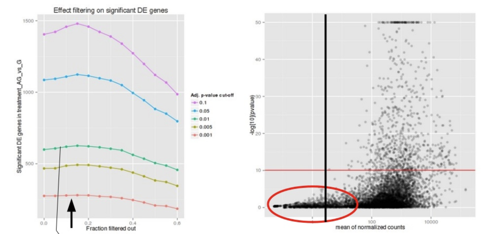
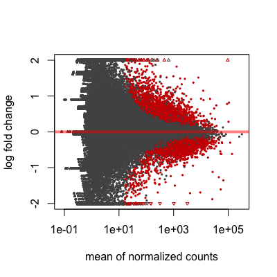
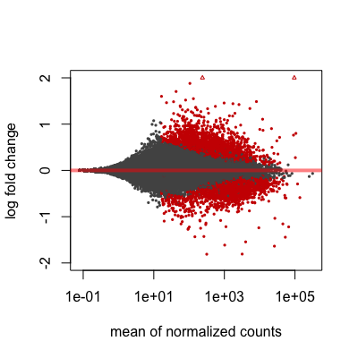

Approximate time: 60 minutes

## Learning Objectives 

* Discuss the steps required to generate a results table for pairwise comparisons (Wald test)
* Summarize the different levels of gene filtering 
* Explain log fold change shrinkage


# Exploring Results (Wald test)

By default DESeq2 uses the Wald test to identify genes that are differentially expressed between two sample classes. Given the factor(s) used in the design formula, and how many factor levels are present, we can extract results for a number of different comparisons. Here, we will walk through how to obtain results from the `dds` object and provide some explanations on how to interpret them.

> **NOTE:** The Wald test can also be used with **continuous variables**. If the variable of interest provided in the design formula is continuous-valued, then the reported `log2FoldChange` is per unit of change of that variable.

## Specifying contrasts

In our dataset, we have a single variable in our design formula which has three sample classes (levels) so we can make three possible pairwise comparisons:

1. Control vs. Mov10 overexpression
2. Control vs. Mov10 knockdown
3. Mov10 knockdown vs. Mov10 overexpression

**We are really only interested in #1 and #2 from above**. When we intially created our `dds` object we had provided `~ sampletype` as our design formula, indicating that `sampletype` is our main factor of interest.

To indicate which two sample classes we are interested in comparing, we need to specify **contrasts**. The contrasts are used as input to the DESeq2 `results()` function to extract the desired results. 

> **_NOTE:_ If we run the `results()` function without specifying `contrast` or `name`, it will return the comparison of the last level of the last variable in the design formula over the first level of this variable.** If the order of levels are not specified, they are ordered alphabetically by DESeq2.

Contrasts can be specified in two different ways (with the first method more commonly used):

1. Contrasts can be supplied as a **character vector with exactly three elements**: the name of the factor (of interest) in the design formula, the name of the two factors levels to compare. The factor level given last is the base level for the comparison. The syntax is given below:
	
```r
	# DO NOT RUN!
	contrast <- c("condition", "level_to_compare", "base_level")
	results(dds, contrast = contrast)
```

2. Contrasts can be given as a **list of 2 character vectors**: the names of the fold changes for the level of interest, and the names of the fold changes for the base level. These names should match identically to the elements of `resultsNames(object)`. *This method can be useful for combining interaction terms and main effects.*

```r
	# DO NOT RUN!
	resultsNames(dds) # to see what names to use
	contrast <- list(resultsNames(dds)[1], resultsNames(dds)[2])
	results(dds, contrast = contrast)
```

Alternatively, if you **only had two factor levels you could do nothing** and not worry about specifying contrasts (i.e. `results(dds)`). In this case, DESeq2 will choose what your base factor level based on alphabetical order of the levels.

To start, we want to evaluate **expression changes between the MOV10 overexpression samples and the control samples**. As such we will use the first method for specifcying contrasts and create a character vector:

```r
## Define contrasts for MOV10 overexpression
contrast_oe <- c("sampletype", "MOV10_overexpression", "control")
```

> ### Does it matter what I choose to be my base level?
> 
> Yes, it does matter. **Deciding what level is the base level will determine how to interpret the fold change that is reported.**  So for example, if we observe a log2 fold change of -2 this would mean the gene expression is lower in factor level of interest relative to the base level. Thus, if leaving it up to DESeq2 to decide on the contrasts be sure to check that the alphabetical order coincides with the fold change direction you are anticipating.


## The results table

Now that we have our contrast created, we can use it as input to the `results()` function. Let's take a quick look at the help manual for the function:

```r
?results
```
You will see we have the option to provide a wide array of arguments and tweak things from the defaults as needed. As we go through the lesson we will keep coming back to the help documentation to discuss some arguments that are good to know about.
 
```r
## Extract results for MOV10 overexpression vs control
res_tableOE <- results(dds, contrast=contrast_oe, alpha = 0.05)
```

> **NOTE:** For our analysis, in addition to the `contrast` argument we will also provide a value of 0.05 for the `alpha` argument. We will describe this in more detail when we talk about [gene-level filtering]().

The results table that is returned to us is **a `DESeqResults` object**, which is a simple subclass of DataFrame. In many ways it can be treated like a dataframe (i.e when accessing/subsetting data), however it is important to recognize that there are differences for downstream steps like visualization.

```r
# Check what type of object is returned
class(res_tableOE)
```

Now let's take a look at **what information is stored** in the results:

```r

# What is stored in results?
res_tableOE %>% 
data.frame() %>% 
View()
```

```
log2 fold change (MAP): sampletype MOV10_overexpression vs control 
Wald test p-value: sampletype MOV10_overexpression vs control 
DataFrame with 57914 rows and 6 columns
               		baseMean	log2FoldChange	lfcSE		stat		pvalue		padj
              		<numeric>	<numeric>	<numeric>	<numeric>	<numeric>	<numeric>
ENSG00000000003		3.53E+03	-0.427190489	0.0755347	-5.65604739	1.55E-08	4.47E-07
ENSG00000000005		2.62E+01	0.016159765	0.23735203	0.06584098	9.48E-01	9.74E-01
ENSG00000000419		1.48E+03	0.362663551	0.10761742	3.36995355	7.52E-04	4.91E-03
ENSG00000000457		5.19E+02	0.219135591	0.09768842	2.24476439	2.48E-02	8.21E-02
ENSG00000000460		1.16E+03	-0.261603812	0.07912962	-3.30661411	9.44E-04	5.92E-03
...			...		...		...		...		...		...
```

We have six columns of information reported for each gene (row). We can use the `mcols()` function to extract information on what the values stored in each column represent:

```r
# Get information on each column in results
mcols(res_tableOE, use.names=T)
```

* `baseMean`: mean of normalized counts for all samples
* `log2FoldChange`: log2 fold change
* `lfcSE`: standard error
* `stat`: Wald statistic
* `pvalue`: Wald test p-value
* `padj`: BH adjusted p-values
 

## P-values

The p-value is a probability value used to determine whether there is evidence to reject the null hypothesis. **A smaller p-value means that there is stronger evidence in favor of the alternative hypothesis**. However, because we are performing a test for each individual gene we need to correct these p-values for multiple testing.

**The `padj` column** in the results table represents the p-value adjusted for multiple testing, and is the most important column of the results. Typically, a threshold such as `padj` < 0.05 is a good starting point for identifying significant genes. The default method for **multiple test correction** in DESeq2 is an implementation of the Benjamini-Hochberg false discovery rate (FDR). There are other corrections methods available and can be changed by adding the `pAdjustMethod` argument to the `results()` function.

### Gene-level filtering

Let's take a closer look at our results table. As we scroll through it, you will notice that for **selected genes there are NA values in the `pvalue` and `padj` columns**. What does this mean?


<p align="center">

</p>

The missing values represent genes that have undergone filtering as part of the `DESeq()` function. Prior to differential expression analysis it is **beneficial to omit genes that have little or no chance of being detected as differentially expressed.** This will increase the power to detect differentially expressed genes. DESeq2 does not physically remove any genes from the original counts matrix, and so all genes will be present in your results table. The genes omitted by DESeq2 meet one of the **three filtering criteria outlined below**:

**1. Genes with zero counts in all samples**

If within a row, all samples have zero counts there is no expression information and therefore these genes are not tested. 

```r
# Filter genes by zero expression
res_tableOE[which(res_tableOE$baseMean == 0),] %>% 
data.frame() %>% 
View()
```

> **The baseMean column for these genes will be zero, and the log2 fold change estimates, p-value and adjusted p-value will all be set to NA.**


**2. Genes with an extreme count outlier**

The `DESeq()` function calculates, for every gene and for every sample, a diagnostic test for outliers called Cook’s distance. Cook’s distance is a measure of how much a single sample is influencing the fitted coefficients for a gene, and a large value of Cook’s distance is intended to indicate an outlier count. Genes which contain a Cook’s distance above a threshold are flagged, however at least 3 replicates are required for flagging, as it is difficult to judge which sample might be an outlier with only 2 replicates. We can turn off this filtering by using the `cooksCutoff` argument in the `results()` function.

```r
# Filter genes that have an extreme outlier
res_tableOE[which(is.na(res_tableOE$pvalue) & 
                    is.na(res_tableOE$padj) &
                    res_tableOE$baseMean > 0),] %>% 
  data.frame() %>% 
  View()
```

> **If a gene contains a sample with an extreme count outlier then the p-value and adjusted p-value will be set to NA.** 


**3. Genes with a low mean normalized counts**

DESeq2 defines a low mean threshold, that is empirically determined from your data, in which the fraction of significant genes can be increased by reducing the number of genes that are considered for multiple testing. This is based on the notion that genes with very low counts are not likely to see significant differences typically due to high dispersion.

<p align="center">

</p>

*Image courtesy of [slideshare presentation](https://www.slideshare.net/joachimjacob/5rna-seqpart5detecting-differentialexpression) from Joachim Jacob, 2014.*

At a user-specified value (`alpha = 0.05`), DESeq2 evaluates the change in the number of significant genes as it filters out increasingly bigger portions of genes based on their mean counts, as shown in the figure above. The point at which the number of significant genes reaches a peak is the low mean threshold that is used to filter genes that undergo multiple testing. There is also an argument to turn off the filtering off by setting `independentFiltering = F`.

```r
# Filter genes below the low mean threshold
res_tableOE[which(!is.na(res_tableOE$pvalue) & 
                    is.na(res_tableOE$padj) & 
                    res_tableOE$baseMean > 0),] %>% 
  data.frame() %>% 
  View()
```

> **If a gene is filtered by independent filtering, then only the adjusted p-value will be set to NA.** 

> _**NOTE:** DESeq2 will perform the filtering outlined above by default; however other DE tools, such as EdgeR will not.  Filtering is a necessary step, even if you are using limma-voom and/or edgeR's quasi-likelihood methods. Be sure to follow pre-filtering steps when using other tools, as outlined in their user guides found on Bioconductor as they generally perform much better._

## Fold change

Another important column in the results table, is the `log2FoldChange`. With large significant gene lists it can be hard to extract meaningful biological relevance. To help increase stringency, one can also **add a fold change threshold**. Keep in mind when setting that value that we are working with log2 fold changes, so a cutoff of `log2FoldChange` < 1 would translate to an actual fold change of 2.

> ### An alternative approach to add the fold change threshold:
> The `results()` function has an option to add a fold change threshold using the `lfcThrehsold` argument. This method is more statistically motivated, and is recommended when you want a more confident set of genes based on a certain fold-change. It actually performs a statistical test against the desired threshold, by performing a two-tailed test for log2 fold changes greater than the absolute value specified. The user can change the alternative hypothesis using `altHypothesis` and perform two one-tailed tests as well. **This is a more conservative approach, so expect to retrieve a much smaller set of genes!**
>

The fold changes reported in the results table are calculated by:

```r
log2 (normalized_counts_group1 / normalized_counts_group2)
```

The problem is, these fold change estimates are not entirely accurate as they do not account for the large dispersion we observe with low read counts. To address this, the **log2 fold changes need to be adjusted**. 


### More accurate LFC estimates

To generate more accurate log2 foldchange (LFC) estimates, DESeq2 allows for the **shrinkage of the LFC estimates toward zero** when the information for a gene is low, which could include:

- Low counts
- High dispersion values

LFC shrinkage uses **information from all genes** to generate more accurate estimates. Specifically, the distribution of LFC estimates for all genes is used (as a prior) to shrink the LFC estimates of genes with little information or high dispersion toward more likely (lower) LFC estimates. 

<p align="center">

</p>

*Illustration taken from the [DESeq2 paper](https://genomebiology.biomedcentral.com/articles/10.1186/s13059-014-0550-8).*

In the figure above, we have an example using two genes green gene and purple gene. For each gene the expression values are plotted for each sample in the two different mouse strains (C57BL/6J and DBA/2J). Both genes have the same mean values for the two sample groups, but the green gene has little variation within group while the purple gene has high levels of variation. For the green gene with low within group variation, the **unshrunken LFC estimate** (vertex of the green **solid line**) is very similar to the shrunken LFC estimate (vertex of the green dotted line). However, LFC estimates for the purple gene are quite different due to the high dispersion. So even though two genes can have similar normalized count values, they can have differing degrees of LFC shrinkage. Notice the **LFC estimates are shrunken toward the prior (black solid line)**.

**Shrinking the log2 fold changes will not change the total number of genes that are identified as significantly differentially expressed.** The shrinkage of fold change is to help with downstream assessment of results. For example, if you wanted to subset your significant genes based on fold change for further evaluation, you may want to use shruken values. Additionally, for functional analysis tools such as GSEA which require fold change values as input you would want to provide shrunken values.

To generate the shrunken log2 fold change estimates, you have to run an additional step on your results object (that we will create below) with the function `lfcShrink()`.

```r
## Save the unshrunken results to compare
res_tableOE_unshrunken <- res_tableOE

# Apply fold change shrinkage
res_tableOE <- lfcShrink(dds, coef="sampletype_MOV10_overexpression_vs_control", type="apeglm")
```

Depending on the version of DESeq2 you are using the default **method for shrinkage estimation** will differ. The defaults can be changed by adding the argument `type` in the `lfcShrink()` function as we have above. For most recent versions of DESeq2, `type="normal"` is the default and was the only method in earlier versions. It has been shown that in most situations there are alternative methods that have [less bias than the 'normal` method](https://bioconductor.org/packages/devel/bioc/vignettes/apeglm/inst/doc/apeglm.html), and therefore **we chose to use apeglm**. 

_Note that the `stat` column is no longer present in the results table._ You can compare by inspecting the output of `res_tableOE` and `res_tableOE_unshrunken` in the R console. If you run `type="apeglm"` or `type="ashr"` you do not get a stat column because these don't really make sense in the context of the posterior quantities that are returned.

> For more information on shrinkage, the DESeq2 vignette has an [Extended section on shrinkage estimators](http://bioconductor.org/packages/devel/bioc/vignettes/DESeq2/inst/doc/DESeq2.html#extended-section-on-shrinkage-estimators) that is quite useful.


> #### `contrast` vs `coef`
> When using the alternative methods, rather than using the `contrast` argument you will be required to specify `coef`. Using contrast forms an expanded model matrix, treating all factor levels equally, and averages over all distances between all pairs of factor levels to estimate the prior. Using coef, means looking only at that column of the model matrix (so usually that would be one level against the reference level) and estimates the prior for that coefficient from the distribution of those MLE of coefficients. When using coef, the shrinkage depends on which level is chosen as reference.

> #### How do I know what to value to provide to the `coef` argument?
> The value you provide here needs to match identically to what is stored in the column header of the coefficients table. To see what values you have to work with you can use `resultsNames(dds)`.


## MA plot

A plot that can be useful to exploring our results is the MA plot. The MA plot shows the **mean of the normalized counts versus the log2 foldchanges for all genes tested**. The genes that are significantly DE are colored to be easily identified. This is also a great way to illustrate the effect of LFC shrinkage. The DESeq2 package offers a simple function to generate an MA plot. 

**Let's start with the unshrunken results:**

```r
# MA plot using unshrunken fold changes
plotMA(res_tableOE_unshrunken, ylim=c(-2,2))
```

**And now the shrunken results:**

```r
# MA plot using shrunken fold changes
plotMA(res_tableOE, ylim=c(-2,2))
```

On the left you have the unshrunken fold change values plotted and you can see the abundance of scatter for the the lowly expressed genes. That is, many of the low expressors exhibit very high fold changes. After shrinkage, we see the fold changes are much smaller estimates.

<p float="left">
  
  
</p>


In addition to the comparison described above, this plot allows us to evaluate the magnitude of fold changes and how they are distributed relative to mean expression. Generally, we would expect to see significant genes across the full range of expression levels. 


***

**Excercise**

**MOV10 Differential Expression Analysis: Control versus Knockdown**

Now that we have results for the overexpression results, do the same for the **Control vs. Knockdown samples**. 

1. Create a contrast vector called `contrast_kd`.
2. Use contrast vector in the `results()` to extract a results table and store that to a variable called `res_tableKD`. 
3. Shrink the LFC estimates using `lfcShrink()` and assign it back to `res_tableKD`.


---
*This lesson has been developed by members of the teaching team at the [Harvard Chan Bioinformatics Core (HBC)](http://bioinformatics.sph.harvard.edu/). These are open access materials distributed under the terms of the [Creative Commons Attribution license](https://creativecommons.org/licenses/by/4.0/) (CC BY 4.0), which permits unrestricted use, distribution, and reproduction in any medium, provided the original author and source are credited.*

*Some materials and hands-on activities were adapted from [RNA-seq workflow](http://www.bioconductor.org/help/workflows/rnaseqGene/#de) on the Bioconductor website*

***
