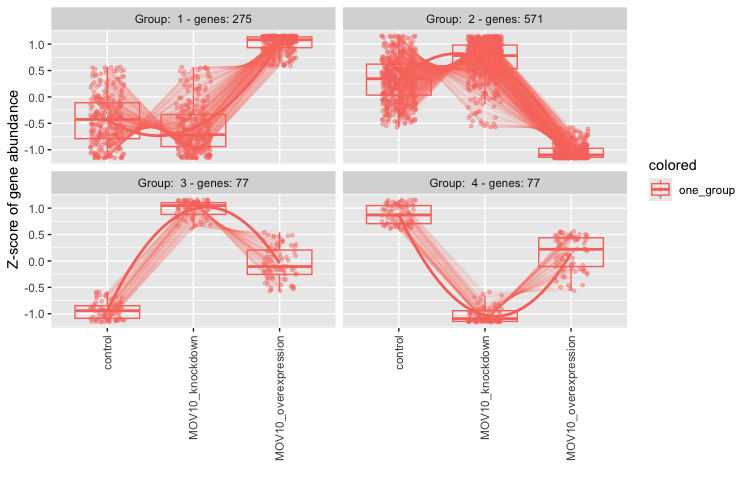

Approximate time: 60 minutes

## Learning Objectives 

* Apply the Likelihood Ratio Test (LRT) for hypothesis testing
* Compare results generated from the LRT to results obtained using the Wald test
* Identify shared expression profiles from the LRT significant gene list


## Exploring results from the Likelihood ratio test (LRT)

DESeq2 also offers the Likelihood Ratio Test as an alternative **when evaluating expression change across more than two levels**. Genes which are identified as significant, are those that are changing in expression in any direction across the different factor levels.

Generally, this test will result in a larger number of genes than the individual pair-wise comparisons. While the LRT is a test of significance for differences of any level(s) of the factor, one should not expect it to be exactly equal to the union of sets of genes using Wald tests (although we do expect a high degree of overlap).

## The `results()` table

To extract the results from our `dds_lrt` object we can use the same `results()` function we had used with the Wald test. _There is no need for contrasts since we are not making a pair-wise comparison._

> **NOTE:** In an [earlier lesson](05a_hypothesis_testing.md#likelihood-ratio-test-lrt) on hypothesis testing, we had you create the object `dds_lrt`. If you are **having trouble finding the object**, please run the code: `dds_lrt <- DESeq(dds, test="LRT", reduced = ~ 1`

```r
# Extract results for LRT
res_LRT <- results(dds_lrt)
```

Let's take a look at the results table:

```r
# View results for LRT
res_LRT  
```

```
log2 fold change (MLE): sampletype MOV10 overexpression vs control 
LRT p-value: '~ sampletype' vs '~ 1' 
DataFrame with 57761 rows and 6 columns
                        baseMean     log2FoldChange              lfcSE             stat               pvalue                 padj
                       <numeric>          <numeric>          <numeric>        <numeric>            <numeric>            <numeric>
ENSG00000000003 3525.88347786355 -0.438245423329571 0.0774607246185232 40.4611749305021 1.63669402960044e-09 3.14070461117016e-08
ENSG00000000005 26.2489043110535 0.0292079869376247  0.441128912409409 1.61898836146221    0.445083140923522     0.58866891597654
ENSG00000000419 1478.25124052691  0.383635036119846  0.113760957175207 11.3410110249776  0.00344612277761083   0.0122924772964227
ENSG00000000457  518.42202383345  0.228970583496456  0.102331174090148 14.6313920603898 0.000665018279181725  0.00304543241149833
ENSG00000000460 1159.77613645835 -0.269138203013482 0.0814992499897986 25.0394477225533 3.65386933066256e-06 3.23415706764646e-05
...                          ...                ...                ...              ...                  ...                  
```

The results table output looks similar to the Wald test results, with identical columns to what we observed previously. 

### Why are fold changes reported for an LRT test?

For analyses using the likelihood ratio test, the p-values are determined solely by the difference in deviance between the full and reduced model formula. **A single log2 fold change is printed in the results table for consistency with other results table outputs, but is not associated with the actual test.**

**Columns relevant to the LRT test:**

* `baseMean`: mean of normalized counts for all samples
* `stat`: the difference in deviance between the reduced model and the full model
* `pvalue`: the stat value is compared to a chi-squared distribution to generate a pvalue
* `padj`: BH adjusted p-values

**Additional columns:**

* `log2FoldChange`: log2 fold change
* `lfcSE`: standard error

> **NOTE:** Printed at the top of the the results table are the two sample groups used to generate the log2 fold change values that we observe in the results table. This can be controlled using the `name` argument; the value provided to name must be an element of resultsNames(dds).

## Identifying significant genes

When filtering significant genes from the LRT we threshold only the `padj` column. _How many genes are significant at `padj < 0.05`?_

```r
# Create a tibble for LRT results
res_LRT_tb <- res_LRT %>%
  data.frame() %>%
  rownames_to_column(var="gene") %>% 
  as_tibble()

# Subset to return genes with padj < 0.05
sigLRT_genes <- res_LRT_tb %>% 
  dplyr::filter(padj < padj.cutoff)

# Get number of significant genes
nrow(sigLRT_genes)

# Compare to numbers we had from Wald test
nrow(sigOE)
nrow(sigKD)

```

The number of significant genes observed from the LRT is quite high. This list includes genes that can be changing in any direction across the three factor levels (control, KO, overexpression). To reduce the number of significant genes, we can increase the stringency of our FDR threshold (`padj.cutoff`).

***

**Exercise**

1. Compare the resulting gene list from the LRT test to the gene lists from the Wald test comparisons.
    1. How many of the `sigLRT_genes` overlap with the significant genes in `sigOE`?
    1. How many of the `sigLRT_genes` overlap with the significant genes in `sigKD`?

***

## Identifying clusters of genes with shared expression profiles

We now have this list of ~7K significant genes that we know are changing in some way across the three different sample groups. What do we do next?

A good next step is to identify groups of genes that share a pattern of expression change across the sample groups (levels). To do this we will be using a clustering tool called `degPatterns` from the 'DEGreport' package. The `degPatterns` tool uses a **hierarchical clustering approach based on pair-wise correlations** between genes, then cuts the hierarchical tree to generate groups of genes with similar expression profiles. The tool cuts the tree in a way to optimize the diversity of the clusters, such that the variability inter-cluster > the variability intra-cluster.

Before we begin clustering, we will **first subset our rlog transformed normalized counts** to retain only the differentially expressed genes (padj < 0.05). In our case, it may take some time to run the clustering on 7K genes, and so for class demonstration purposes we will subset to keep only the top 1000 genes sorted by p-adjusted value. 

> #### Where do I get rlog transformed counts?
> This rlog transformation was applied in an [earlier lesson](03_DGE_QC_analysis.md#transform-normalized-counts-for-the-mov10-dataset) when we performed QC analysis. If you **do not see this in your environment**, run the following code:
> 
> ```
> ### Transform counts for data visualization
> rld <- rlog(dds, blind=TRUE)
> rld_mat <- assay(rld)
> ```
> 

```r
# Subset results for faster cluster finding (for classroom demo purposes)
clustering_sig_genes <- sigLRT_genes %>%
  arrange(padj) %>%
  head(n=1000)


# Obtain rlog values for those significant genes
cluster_rlog <- rld_mat[clustering_sig_genes$gene, ]
```

The rlog transformed counts for the significant genes are input to `degPatterns` along with a few additional arguments:

* `metadata`: the metadata dataframe that corresponds to samples
* `time`: character column name in metadata that will be used as variable that changes
* `col`: character column name in metadata to separate samples

```r
# Use the `degPatterns` function from the 'DEGreport' package to show gene clusters across sample groups
clusters <- degPatterns(cluster_rlog, metadata = meta, time = "sampletype", col=NULL)
```

Once the clustering is finished running, you will get your command prompt back in the console and you should see a figure appear in your plot window. The genes have been clustered into four different groups. For each group of genes, we have a boxplot illustrating expression change across the different sample groups. A line graph is overlayed to illustrate the trend in expression change.


<p align="center">

</p>


Suppose we are interested in the genes which show a decreased expression in the knockdown samples and increase in the overexpression. According to the plot there are 275 genes which share this expression profile. To find out what these genes are let's explore the output. What type of data structure is the `clusters` output?

```r
# What type of data structure is the `clusters` output?
class(clusters)
```
We can see what objects are stored in the list by using `names(clusters)`. There is a dataframe stored inside. This is the main result so let's take a look at it. The first column contains the genes, and the second column contains the cluster number to which they belong.

```r
# Let's see what is stored in the `df` component
head(clusters$df)
```

Since we are interested in Group 1, we can filter the dataframe to keep only those genes:

```r
# Extract the Group 1 genes
group1 <- clusters$df %>%
          dplyr::filter(cluster == 1)
```

After extracting a group of genes, we can use annotation packages to obtain additional information. We can also use these lists of genes as input to downstream functional analysis tools to obtain more biological insight and see whether the groups of genes share a specific function. 


---
*This lesson has been developed by members of the teaching team at the [Harvard Chan Bioinformatics Core (HBC)](http://bioinformatics.sph.harvard.edu/). These are open access materials distributed under the terms of the [Creative Commons Attribution license](https://creativecommons.org/licenses/by/4.0/) (CC BY 4.0), which permits unrestricted use, distribution, and reproduction in any medium, provided the original author and source are credited.*

* *Materials and hands-on activities were adapted from [RNA-seq workflow](http://www.bioconductor.org/help/workflows/rnaseqGene/#de) on the Bioconductor website*

