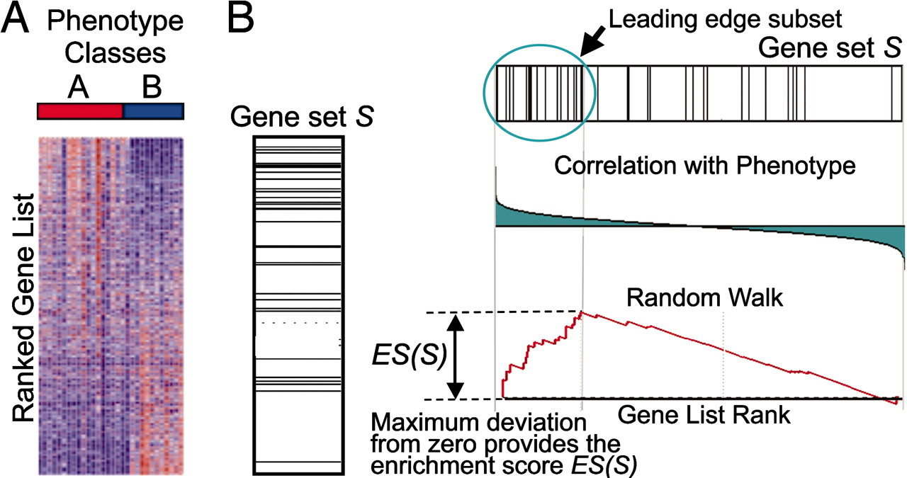
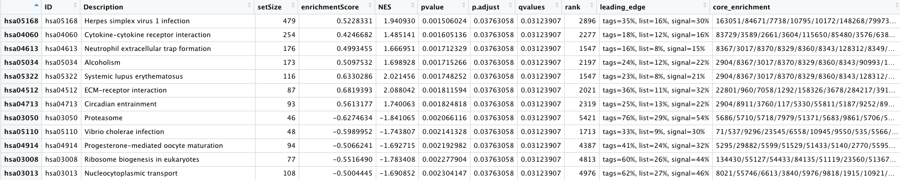
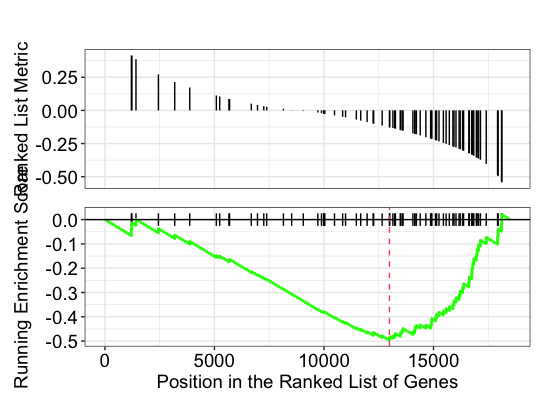
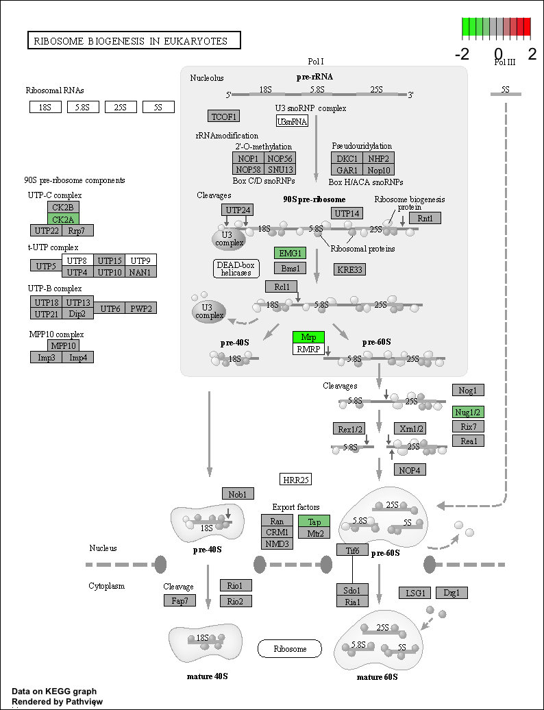

Approximate time: 40 minutes

Learning Objectives:
-------------------

*  Discuss functional class scoring, and pathway topology methods
*  Construct a GSEA analysis using GO and KEGG gene sets
*  Examine results of a GSEA using pathwview package
*  List other tools and resources for identifying genes of novel pathways or networks

## Functional analysis using functional class scoring 

In addition to over-representation analysis, there are other types of analyses can be equally important or informative for obtaining some biological insight from your results. The **hypothesis behind functional class scoring (FCS) methods** is that although large changes in individual genes can have significant effects on pathways (and will be detected via ORA methods), **weaker but coordinated changes in sets of functionally related genes (i.e., pathways) can also have significant effect**s.  Thus, rather than setting an arbitrary threshold to identify 'significant genes', **all genes are considered** in the analysis. The gene-level statistics from the dataset are aggregated to generate a single pathway-level statistic and statistical significance of each pathway is reported. This type of analysis can be particularly helpful if the differential expression analysis only outputs a small list of significant DE genes. 

<p align="center"> 

</p> 


## Gene set enrichment analysis using clusterProfiler and Pathview

One commonly used tool which is classified under Functional class scoring (FCS), is [GSEA](https://www.pnas.org/content/102/43/15545). Gene set enrichment analysis utilizes the gene-level statistics or log2 fold changes for all genes to look to see whether gene sets for particular biological pathways are enriched among the large positive or negative fold changes. 

<p align="center"> 

</p> 
  
Gene sets are pre-defined groups of genes, which are functionally related. Commonly used gene sets include those derived from KEGG pathways, Gene Ontology terms, MSigDB, Reactome, or gene groups that share some other functional annotations, etc. [[1](../../resources/pathway_tools.pdf)]. 

### Preparation for GSEA

The clusterProfiler package offers several functions to perform GSEA using different genes sets, including but not limited to GO, KEGG, and MSigDb. We will use the KEGG gene sets in our examples below. The KEGG gene sets are defined using the Entrez identifiers, thus to perform the analysis we will need to acquire the corresponding Entrez IDs for our genes. We will also need to remove any genes that do not have an Entrez ID (NA values) and any duplicates (due to gene ID conversion) that may exist:

```r
## Remove any NA values (reduces the data by quite a bit)
res_entrez <- dplyr::filter(res_ids, entrezid != "NA")

## Remove any Entrez duplicates
res_entrez <- res_entrez[which(duplicated(res_entrez$entrezid) == F), ]
```

GSEA will use the log2 fold changes obtained from the differential expression analysis for every gene, to perform the analysis. We will obtain a vector of fold changes for input to clusterProfiler, in addition to the associated Entrez IDs:

```r
## Extract the foldchanges
foldchanges <- res_entrez$log2FoldChange

## Name each fold change with the corresponding Entrez ID
names(foldchanges) <- res_entrez$entrezid
```

Next we need to order the fold changes in decreasing order. To do this we'll use the `sort()` function, which takes a vector as input. This is in contrast to Tidyverse's `arrange()`, which requires a data frame.

```r
## Sort fold changes in decreasing order
foldchanges <- sort(foldchanges, decreasing = TRUE)

head(foldchanges)
```

### Theory of GSEA

Now we are ready to perform GSEA. The details regarding GSEA can be found in the [PNAS paper](https://www.pnas.org/content/102/43/15545) by Subramanian et al. We will describe briefly the steps outlined in the paper below:

<p align="center"> 

</p>

_**Image credit:** [Subramanian et al. Proceedings of the National Academy of Sciences Oct 2005, 102 (43) 15545-15550; DOI: 10.1073/pnas.0506580102](https://www.pnas.org/content/102/43/15545)_

This image describes the theory of GSEA, with the 'gene set S' showing the metric used (in our case, ranked log2 fold changes) to determine enrichment of genes in the gene set. The left-most image is representing this metric used for the GSEA analysis. The log2 fold changes for each gene in the 'gene set S' is shown as a line in the middle image. The large positive log2 fold changes are at the top of the gene set image, while the largest negative log2 fold changes are at the bottom of the gene set image. In the right-most image, the gene set is turned horizontally, underneath which is an image depicting the calculations involved in determining enrichment, as described below.

**Step 1:** Calculation of enrichment score: 

An enrichment score for a particular gene set is calculated by walking down the list of log2 fold changes and increasing the running-sum statistic every time a gene in the gene set is encountered and decreasing it when genes are not part of the gene set. The size of the increase/decrease is determined by magnitude of the log2 fold change. Larger (positive or negative) log2 fold changes will result in larger increases or decreases. The final enrichment score is where the running-sum statistic is the largest deviation from zero.

**Step 2:** Estimation of significance:

The significance of the enrichment score is determined using permutation testing, which performs rearrangements of the data points to determine the likelihood of generating an enrichment score as large as the enrichment score calculated from the observed data. Essentially, for this step, the first permutation would reorder the log2 fold changes and randomly assign them to different genes, reorder the gene ranks based on these new log2 fold changes, and recalculate the enrichment score. The second permutation would reorder the log2 fold changes again and recalculate the enrichment score again, and this would continue for the total number of permutations run. Therefore, the number of permutations run will increase the confidence in the signficance estimates.

**Step 3:** Adjust for multiple test correction

After all gene sets are tested, the enrichment scores are normalized for the size of the gene set, then the p-values are corrected for multiple testing.

The GSEA output will yield the core genes in the gene sets that most highly contribute to the enrichment score. The genes output are generally the genes at or before the running sum reaches its maximum value (eg. the most influential genes driving the differences between conditions for that gene set).

### Performing GSEA

First, we will set the seed so that we all obtain the same result:

```r
set.seed(123456)
```
> _**NOTE:** The permutations are performed using random reordering, so every time we run the function we will get slightly different results. If we would like to use the same permutations every time we run a function, then we use the `set.seed(123456)` function prior to running. The input to `set.seed()` can be any number, but if you would want the same results, then you would need to use the same number as the lesson._

To perform the GSEA using KEGG gene sets with clusterProfiler, we can use the `gseKEGG()` function. _The organisms with available KEGG pathway information are listed [here](http://www.genome.jp/kegg/catalog/org_list.html)._


```r
## GSEA using gene sets from KEGG pathways
gseaKEGG <- gseKEGG(geneList = foldchanges, # ordered named vector of fold changes (Entrez IDs are the associated names)
              organism = "hsa", # supported organisms listed below
              minGSSize = 20, # minimum gene set size (# genes in set) - change to test more sets or recover sets with fewer # genes
              pvalueCutoff = 0.05, # padj cutoff value
              verbose = FALSE)

## Extract the GSEA results
gseaKEGG_results <- gseaKEGG@result

# Write results to file
write.csv(gseaKEGG_results, "results/gseaOE_kegg.csv", quote=F)
```

**How many pathways are enriched?** _NOTE: The results may look slightly different for you._ 

```r
## Write GSEA results to file
View(gseaKEGG_results)
```

<p align="center"> 

</p>

* The first few columns of the results table identify the pathway information
* The following columns include the associated statistics
* The last column will report which genes are part of the 'core enrichment'. These are the genes associated with the pathway which contributed to the observed enrichment score (i.e. in the extremes of the ranking). The genes are listed by EntrezID.

> _**NOTE:** The DOSE package has a handy function which allows us to easily convert the list of Entrez identifiers into gene symbols. This is possible if and only if there is an OrgDb available for your organism. The function takes the gseaKEGG object as input and returns the same object with the gene symbols in the 'core enrichment' column._
> 
> ```
> ## Example Code
> gseaKEGG_geneSymbol <- setReadable(gseaKEGG, OrgDb = org.Hs.eg.db, keyType="ENTREZID")
> ```
> 


Let's explore the GSEA plot of enrichment of one of the pathways in the ranked list:

```r
## Plot the GSEA plot for a single enriched pathway, `hsa03040`
gseaplot(gseaKEGG, geneSetID = 'hsa03008')
```
<p align="center"> 

</p>

In this plot, the lines in plot represent the genes in the gene set 'hsa03008', and where they occur among the log2 fold changes. The largest positive log2 fold changes are on the left-hand side of the plot, while the largest negative log2 fold changes are on the right. The top plot shows the magnitude of the log2 fold changes for each gene, while the bottom plot shows the running sum, with the enrichment score peaking at the red dotted line (which is among the negative log2 fold changes). This suggests the down-regulation of this pathway.

Use the [Pathview R package](http://bioconductor.org/packages/release/bioc/html/pathview.html) to integrate the KEGG pathway data from clusterProfiler into pathway images:

```r
detach("package:dplyr", unload=TRUE) # first unload dplyr to avoid conflicts

## Output images for a single significant KEGG pathway
pathview(gene.data = foldchanges,
              pathway.id = "hsa03008",
              species = "hsa",
              limit = list(gene = 2, # value gives the max/min limit for foldchanges
              cpd = 1))
```
>**NOTE:** If the below error message occurs: `Error in detach("package:dplyr", unload = T) : invalid 'name' argument`, that means the dplyr package is not currently loaded. Ignore the message and continue to run pathview command.

>**NOTE:** pathview may not display in your R Plots window. Instead, you may see a message such as `Info: Working in directory /Users/yourname/Desktop/DEanalysis` and `Info: Writing image file hsa03008.pathview.png`. This indicates that the image has instead been saved to that directory. You can open the pathview file to view it.

<p align="center"> 

</p>


>**NOTE:** Printing out Pathview images for all significant pathways can be easily performed as follows:
>
> ```r
>## Output images for all significant KEGG pathways
> get_kegg_plots <- function(x) {
>    pathview(gene.data = foldchanges, 
>             pathway.id = gseaKEGG_results$ID[x], 
>             species = "hsa",
>             limit = list(gene = 2, cpd = 1))
> }
>
> purrr::map(1:length(gseaKEGG_results$ID), 
>            get_kegg_plots)
> ```

### Incorpororating other gene sets for GSEA

There are other gene sets available for GSEA analysis in clusterProfiler (Disease Ontology, Reactome pathways, etc.). In addition, it is possible to supply your own gene set GMT file, and use that as input.

The Molecular Signatures Database (also known as [MSigDB](http://software.broadinstitute.org/gsea/msigdb/index.jsp)) is a collection of annotated gene sets. It contains 8 major collections:

* H: hallmark gene sets
* C1: positional gene sets
* C2: curated gene sets
* C3: motif gene sets
* C4: computational gene sets
* C5: GO gene sets
* C6: oncogenic signatures
* C7: immunologic signatures

Users can download GMT files from Broad Institute and use the read.gmt() function to parse the files. Alternatively, there is an R package that already packed the MSigDB gene sets in tidy data format that can be used directly with clusterProfiler. The `msigdbr` package supports severa species and some example code is provided below:

```r
# DO NOT RUN

library(msigdbr)
msigdbr_show_species()

##  [1] "Anolis carolinensis"             "Bos taurus"                     
##  [3] "Caenorhabditis elegans"          "Canis lupus familiaris"         
##  [5] "Danio rerio"                     "Drosophila melanogaster"        
##  [7] "Equus caballus"                  "Felis catus"                    
##  [9] "Gallus gallus"                   "Homo sapiens"                   
## [11] "Macaca mulatta"                  "Monodelphis domestica"          
## [13] "Mus musculus"                    "Ornithorhynchus anatinus"       
## [15] "Pan troglodytes"                 "Rattus norvegicus"              
## [17] "Saccharomyces cerevisiae"        "Schizosaccharomyces pombe 972h-"
## [19] "Sus scrofa"                      "Xenopus tropicalis"

# Use a specific collection; example C6 oncogenic signatures
m_t2g <- msigdbr(species = "Homo sapiens", category = "C6") %>% 
  dplyr::select(gs_name, entrez_gene)

# Run GSEA
msig_GSEA <- GSEA(foldchanges, TERM2GENE = m_t2g, verbose = FALSE)

```

## Functional analysis: Pathway topology tools

<p align="center"> 

</p>

The last main type of functional analysis technique is pathway topology analysis. Pathway topology analysis often takes into account gene interaction information along with the fold changes and adjusted p-values from differential expression analysis to identify dysregulated pathways. Depending on the tool, pathway topology tools explore how genes interact with each other (e.g. activation, inhibition, phosphorylation, ubiquitination, etc.) to determine the pathway-level statistics. Pathway topology-based methods utilize the number and type of interactions between gene product (our DE genes) and other gene products to infer gene function or pathway association. 

For instance, the [SPIA (Signaling Pathway Impact Analysis)](http://bioconductor.org/packages/release/bioc/html/SPIA.html) tool can be used to integrate the lists of differentially expressed genes, their fold changes, and pathway topology to identify affected pathways. We have step-by-step materials for using SPIA [available](pathway_topology.md).

## Other Tools for Functional Analysis

### Co-expression clustering

Co-expression clustering is often used to identify genes of novel pathways or networks by grouping genes together based on similar trends in expression. These tools are useful in identifying genes in a pathway, when their participation in a pathway and/or the pathway itself is unknown. These tools cluster genes with similar expression patterns to create 'modules' of co-expressed genes which often reflect functionally similar groups of genes. These 'modules' can then be compared across conditions or in a time-course experiment to identify any biologically relevant pathway or network information.

You can visualize co-expression clustering using heatmaps, which should be viewed as suggestive only; serious classification of genes needs better methods.  

The way the tools perform clustering is by taking the entire expression matrix and computing pair-wise co-expression values. A network is then generated from which we explore the topology to make inferences on gene co-regulation. The [WGCNA]([https://horvath.genetics.ucla.edu/html/CoexpressionNetwork/Rpackages/WGCNA/](https://web.archive.org/web/20230323144343/horvath.genetics.ucla.edu/html/CoexpressionNetwork/Rpackages/WGCNA/)) package (in R) is one example of a more sophisticated method for co-expression clustering (please note however that it is no longer maintained).


## Resources for functional analysis

* g:Profiler - http://biit.cs.ut.ee/gprofiler/index.cgi 
* DAVID - https://david.ncifcrf.gov
* clusterProfiler - http://bioconductor.org/packages/release/bioc/html/clusterProfiler.html
* GeneMANIA - http://www.genemania.org/
* GenePattern -  http://www.broadinstitute.org/cancer/software/genepattern/ (need to register)
* WebGestalt - http://www.webgestalt.org (need to register)
* AmiGO - http://amigo.geneontology.org/amigo
* ReviGO (visualizing GO analysis, input is GO terms) - http://revigo.irb.hr/ 
* WGCNA - [https://horvath.genetics.ucla.edu/html/CoexpressionNetwork/Rpackages/WGCNA/](https://web.archive.org/web/20230323144343/horvath.genetics.ucla.edu/html/CoexpressionNetwork/Rpackages/WGCNA/) (no longer maintained)
* GSEA - http://software.broadinstitute.org/gsea/index.jsp
* SPIA - https://www.bioconductor.org/packages/release/bioc/html/SPIA.html
* GAGE/Pathview - http://www.bioconductor.org/packages/release/bioc/html/gage.html

***
*This lesson has been developed by members of the teaching team at the [Harvard Chan Bioinformatics Core (HBC)](http://bioinformatics.sph.harvard.edu/). These are open access materials distributed under the terms of the [Creative Commons Attribution license](https://creativecommons.org/licenses/by/4.0/) (CC BY 4.0), which permits unrestricted use, distribution, and reproduction in any medium, provided the original author and source are credited.*
